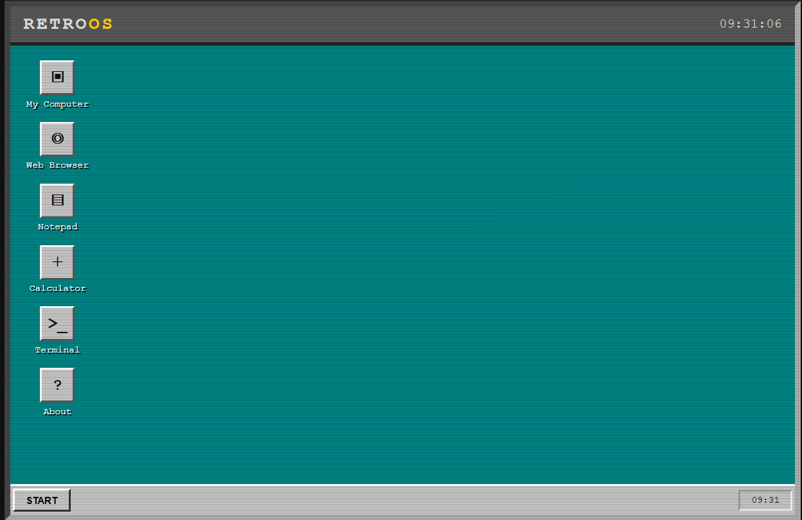

A small 80s-style fake operating system made with **HTML, CSS and JavaScript**.

### Features
- 🖥️ Retro desktop
- 🪟 Draggable windows
- 🌐 Mini browser
- 📝 Notepad
- 🧮 Calculator
- 💻 Terminal
- 📁 My Computer
- ▶️ Start menu

### Run

Open `[index.html](https://retro-os-v1.netlify.app/)` in your browser.

